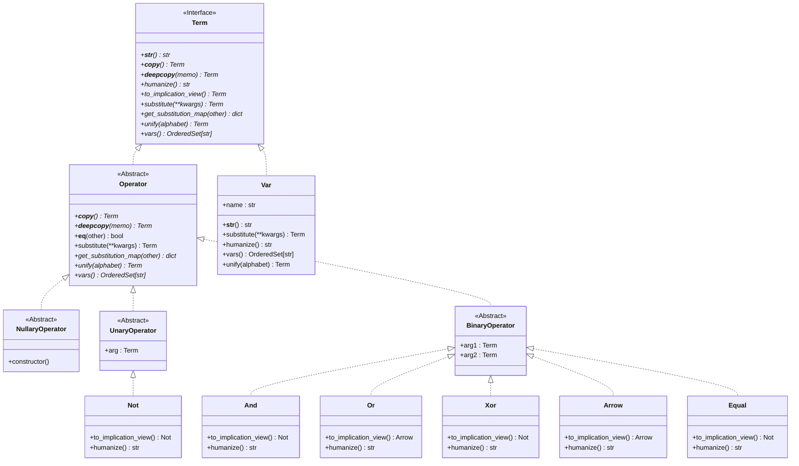

# MLITA_colloq

Задание 1.

Была разработана система классов для работы с логичискими выражениями и очелевеченного их вывода. 

Произведена попытка реализовать программу, выводящую все выражения из исходных. К сожалению удалось вывести лишь А11: A∨¬A(преобразовано к !A->!A).

Протокол вывода А11.
